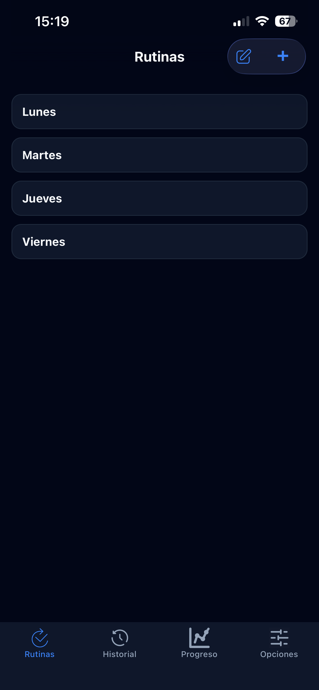
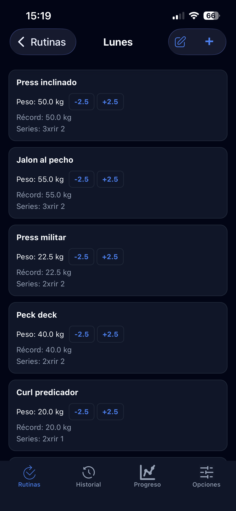
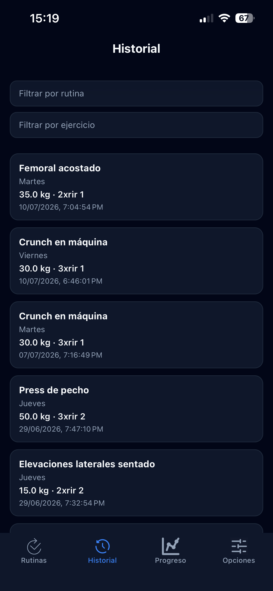
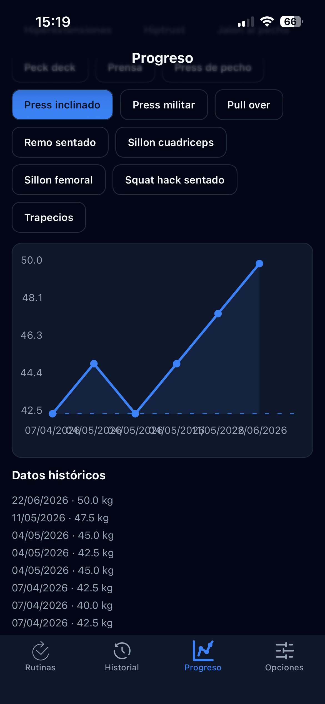
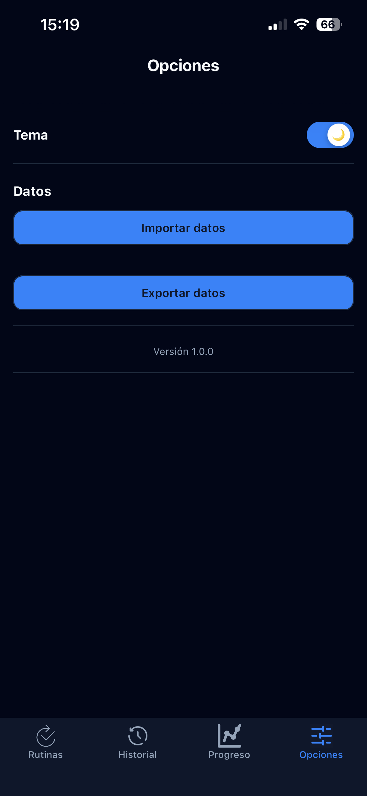

# RoutineApp — Documentación técnica

Este documento complementa al `README.md` (que cubre instalación y uso) y está pensado para cualquier desarrollador que necesite entender, mantener o extender el código.

## 1. Vistazo visual

| Rutinas (Home)                                 | Detalle de rutina                                                     |
| ---------------------------------------------- | --------------------------------------------------------------------- |
|  |  |

| Historial                                                  | Progreso                                                               |
| ---------------------------------------------------------- | ---------------------------------------------------------------------- |
|  |  |

**Opciones (tema + backup):**



## 2. Stack tecnológico

| Capa                   | Tecnología                                                         |
| ---------------------- | ------------------------------------------------------------------ |
| Framework              | React Native + Expo SDK 54                                         |
| Lenguaje               | TypeScript                                                         |
| Navegación             | React Navigation (bottom tabs + native stack anidados)             |
| Persistencia           | SQLite on-device (`expo-sqlite`)                                   |
| Estado global          | React Context API (sin Redux/Zustand)                              |
| Preferencias simples   | AsyncStorage (solo para el tema claro/oscuro)                      |
| Gestos / drag & drop   | `react-native-gesture-handler` + `react-native-draggable-flatlist` |
| Animaciones            | `react-native-reanimated` / `Animated` API nativa                  |
| Gráficos               | `react-native-chart-kit`                                           |
| Import/export de datos | `expo-file-system`, `expo-sharing`, `expo-document-picker`         |
| Build / distribución   | EAS Build (perfiles `preview` y `production` en `eas.json`)        |

No hay backend propio: **toda la app funciona 100% local**, sin llamadas a red ni servidor. Los datos viven en un archivo SQLite dentro del dispositivo.

## 3. Estructura de carpetas

```
RoutineApp-main/
├── App.tsx                # Composición raíz de providers + StatusBar
├── index.ts                # Entry point (registerRootComponent)
├── app.json / eas.json     # Configuración de Expo y perfiles de build
└── src/
    ├── components/          # Componentes de UI reutilizables (cards, inputs, íconos SVG)
    ├── context/              # Estado global: AppContext (datos) y ThemeContext (tema)
    ├── db/                    # Toda la capa de acceso a SQLite, separada por entidad
    ├── navigation/            # Definición de stacks y tabs con React Navigation
    ├── screens/               # Una screen por sección de la app
    ├── theme/                 # Paletas de color light/dark
    └── utils/                 # Helpers puros (formateo, redondeo) y backup JSON
```

La convención es clara: **cada carpeta tiene una sola responsabilidad**. La capa `db` no sabe nada de React; `context` conecta `db` con la UI; `screens`/`components` solo consumen el context, nunca llaman a `db` directamente.

## 4. Modelo de datos

La base SQLite (`routineapp.db`) tiene 3 tablas, creadas en `src/db/database.ts` vía `initDatabase()`:

```
routines                    exercises                      history
─────────                   ──────────                     ────────
id (PK)                     id (PK)                        id (PK)
name                        routine_id (FK → routines.id)  exercise_id (FK → exercises.id)
"order"                     name                            date
created_at                  weight                          weight
                             record                          sets
                             sets
                             "order"
```

Relaciones: `routines 1—N exercises 1—N history`, ambas con `ON DELETE CASCADE` (si se borra una rutina, se borran sus ejercicios y el historial asociado).

### Detalles no evidentes del esquema

- **`record` es un campo desnormalizado y además recalculado en cada `SELECT`.** Al leer ejercicios (`getExercisesByRoutine` / `getAllExercises`), el `record` que se devuelve es el máximo histórico entre todos los ejercicios que comparten el mismo `name` (case-insensitive, trim), no solo el de esa fila puntual. Esto es intencional: si el mismo ejercicio ("Sentadilla") aparece en más de una rutina, el "PR" (mejor marca personal) se comparte entre todas sus apariciones.
- **Normalización de nombres:** `normalizeExerciseName()` (duplicada en `database.ts` y `exercises.ts`) hace `trim()` + colapso de espacios múltiples. Se corre también como migración al arrancar la app (`initDatabase` recorre los ejercicios existentes y los normaliza).
- **El peso se redondea a pasos de 2.5 kg** (`roundToStep`, en `utils/helpers.ts`) al usar los botones +/− de ajuste rápido (`adjustExerciseWeight`). La edición manual vía formulario no tiene esa restricción.
- **Cada cambio de peso genera una fila en `history`** (solo si el peso realmente cambió), lo que alimenta la pantalla de Progreso (gráfico de evolución).
- **`order` es un entero gestionado manualmente**, no un timestamp. El drag & drop de rutinas/ejercicios reescribe todos los `order` de la lista con una serie de `UPDATE` concatenados en un solo `execAsync` (ver `reorderRoutines` / `reorderExercises`).

## 5. Gestión de estado (`src/context`)

### `AppContext.tsx`

Es el corazón de la app: expone rutinas, ejercicios, historial y progreso, junto con todas las funciones para mutarlos. Patrón usado en **todas** las mutaciones:

1. Ejecutar la operación contra SQLite (capa `db/`).
2. Releer del disco y actualizar el estado de React con `setState`.

No hay actualización optimista del estado; siempre se vuelve a consultar la base tras escribir. Es más simple y evita desincronizaciones, a costa de alguna lectura extra (aceptable dado que SQLite es local y rápido).

El bootstrap inicial (`useEffect` sin dependencias) llama a `initDatabase()` → `loadRoutines()` → `loadHistory()`, cada uno con un timeout de 10s (`withTimeout`) para evitar que la app quede colgada en el splash si algo falla.

`importData` / `getExportData` implementan el backup completo: `importData` borra todas las tablas y reinserta todo dentro de una única transacción (`db.withTransactionAsync`), remapeando IDs viejos → nuevos para mantener las relaciones FK consistentes.

### `ThemeContext.tsx`

Maneja únicamente `light`/`dark`. Persiste la preferencia en AsyncStorage bajo la key `routineapp.theme` y expone el objeto de tema (`theme/light.ts` / `theme/dark.ts`) para que cada componente arme sus estilos inline en base a los colores del tema activo (no se usa un sistema de theming como NativeWind/Styled Components).

## 6. Navegación (`src/navigation/AppNavigator.tsx`)

Estructura anidada:

```
NavigationContainer
└── Tab.Navigator (bottom tabs, headerShown: false)
    ├── HomeStack     → Home (lista de rutinas) → Routine (detalle/ejercicios)
    ├── HistoryStack  → History
    ├── ProgressStack → Progress
    └── SettingsStack → Settings
```

Cada tab tiene su propio `NativeStack`, incluso las que hoy tienen una sola pantalla (History, Progress, Settings). Esto es deliberado: deja el terreno preparado para agregar sub-pantallas a futuro sin reestructurar la navegación (por ejemplo, un detalle de historial por ejercicio).

Todas las screens usan `headerTransparent: true` combinado con un `Animated.Value` que interpola la opacidad del header en base al scroll (patrón repetido en Home, History, Progress y Routine) — el header aparece con fondo sólido recién cuando el usuario empieza a scrollear.

Los tipos de rutas (`RootStackParamList`, `HomeStackParamList`, etc.) están todos tipados explícitamente, así que TypeScript valida los parámetros de navegación (ej. `Routine` requiere `{ routineId, routineName }`).

## 7. Componentes clave

| Componente        | Responsabilidad                                                                                 |
| ----------------- | ----------------------------------------------------------------------------------------------- |
| `RoutineCard`     | Card de una rutina en Home, con modo edición (rename/delete)                                    |
| `ExerciseCard`    | Card de un ejercicio dentro de una rutina: peso, sets, record, botones +/− y drag handle        |
| `Button`, `Input` | Primitivos de UI reutilizados en toda la app                                                    |
| `*Icon.tsx`       | Íconos SVG hechos a mano (no se usa una librería de íconos como `lucide` o `expo-vector-icons`) |

El drag & drop (`react-native-draggable-flatlist`) se usa tanto en Home (reordenar rutinas) como en Routine (reordenar ejercicios), y en ambos casos dispara `moveRoutines`/`moveExercises` del context al soltar.

## 8. Utilidades (`src/utils`)

- **`helpers.ts`**: funciones puras sin dependencias — `roundToStep`, `formatDate`, `formatDateTime`, `toKg`. Fáciles de testear si en algún momento se agrega test suite.
- **`storage.ts`**: exporta/importa la base completa como JSON plano (`exportDatabaseJson` / `importDatabaseJson`), usado como mecanismo de backup manual desde Settings. Es una capa distinta (y más simple) que `importData` del `AppContext`: no remapea IDs, inserta los IDs tal cual vienen del backup.

## 9. Decisiones de diseño a tener en cuenta

- **Sin backend ni sincronización en la nube.** Todo el almacenamiento es local vía SQLite, elegido por simplicidad: no requiere levantar ni mantener un backend propio, y evita la complejidad de sincronización entre dispositivos. El backup/restore manual (JSON compartible por Settings) es el único mecanismo de portabilidad de datos entre dispositivos.
- **Sin test suite todavía.** No hay carpeta `__tests__` ni configuración de Jest en `package.json`. Si se agrega, `utils/helpers.ts` y la capa `db/` (con una base SQLite en memoria) son los candidatos más simples para arrancar.
- **Sin gestor de estado externo.** Context API alcanza porque el volumen de datos es chico y no hay necesidad de selectors optimizados; si la app creciera mucho en pantallas simultáneas re-renderizando por cualquier cambio de `exercises`, ahí sí valdría la pena migrar a algo como Zustand.
- **Bundle IDs ya definidos** en `app.json` (`com.gaspi.routineapp`) y proyecto EAS ya vinculado (`projectId` en `extra.eas`), por lo que los builds de preview/producción están listos para generarse con `eas build`.

## 10. Puntos de extensión típicos

- **Nueva pantalla de detalle de ejercicio** (ver histórico y gráfico individual): ya existe `getProgressByExercise` en `db/history.ts`, solo faltaría una screen + ruta dentro de `HomeStack` o `HistoryStack`.
- **Sincronización remota**: si se quisiera migrar de SQLite local a un backend (ej. Supabase, como en el proyecto housing-plan-system), el punto de entrada natural es reemplazar la capa `src/db/*` manteniendo las mismas firmas de función — `AppContext` no debería necesitar cambios grandes.
- **Tests**: dado que `db/*` está desacoplado de la UI, es el lugar más directo para empezar a agregar cobertura.

## 11. Roadmap / pendientes conocidos

- **Estética general**: es el frente de trabajo pendiente más inmediato. La lógica y el modelo de datos están sólidos, pero la interfaz (paleta, espaciados, tipografía, micro-interacciones) todavía tiene margen de pulido. Candidatos concretos:
  - Revisar consistencia de estilos entre pantallas (algunas usan `StyleSheet.create`, otras estilos inline).
  - Explorar una librería de íconos o refinar los SVG hechos a mano en `components/*Icon.tsx`.
  - Afinar el sistema de temas (`theme/light.ts` / `theme/dark.ts`) — hoy es una paleta plana de colores, sin escala tipográfica ni espaciados centralizados.
